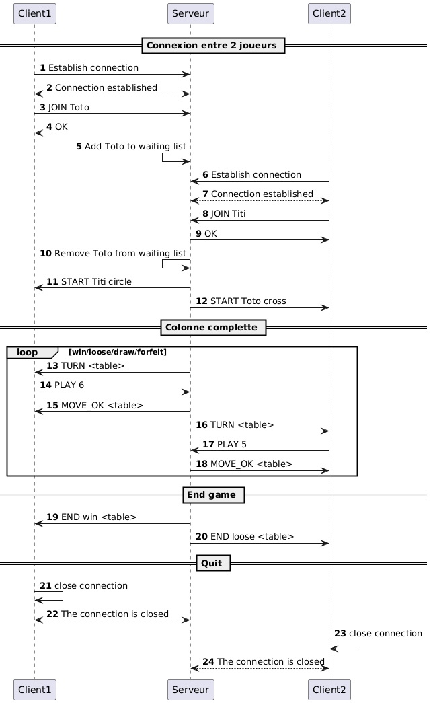
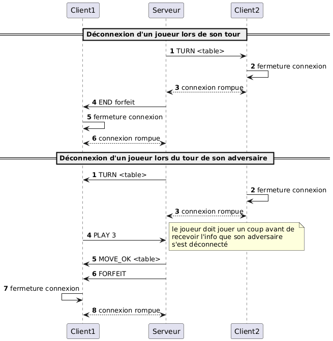
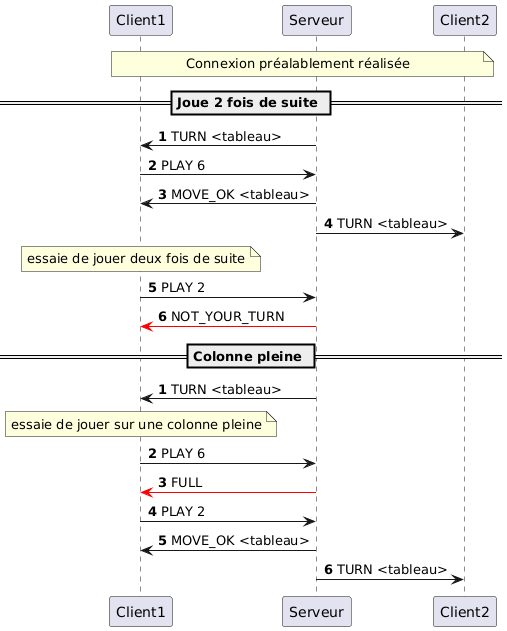
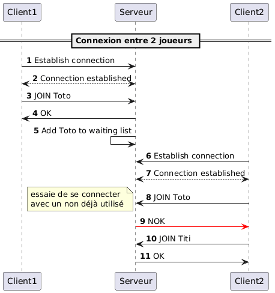

# Protocol applicatif - Puissance4

### table des matières
- [Overview](#1-overview)
- [Protocol de communication](#2-protocol-de-communication)
- [Messages](#3-messages)
- [Exemples](#4-exemples)


## 1. Overview
Puissance4 est un protocole qui définit un système de communication applicatif permettant à deux utilisateurs distants de se connecter à un serveur et de jouer une partie de Puissance 4.
Le serveur agit comme arbitre : il gère les connexions, coordonne les échanges entre les joueurs, valide les actions (placements de jetons), maintient l’état du plateau de jeu et détermine la fin de la partie.
Le protocole garantit ainsi une interaction cohérente, synchronisée et fiable entre les deux clients.

## 2. Protocol de communication

Le protocole Puissance4 est un protocole de transport de messages textuels.
Il s’appuie sur TCP (Transmission Control Protocol) afin de garantir la fiabilité de la transmission des données et l’intégrité des échanges entre le serveur et les clients.
Toutes les communications du protocole doivent utiliser le port 4444.


## 3. Messages

### Rejoindre le serveur

Le client se connecte au serveur via la commande JOIN et en indiquant le nom d'utilisateur
que le joueur souhaite avoir durant la partie.

#### Requête
```text 
JOIN <userName>
```
- `userName` : le pseudo du joueur

#### Réponse
- `OK`: le client est enregistré avec ce nom et est placé en liste d'attente
- `NOK`: indique que le nom d'utilisateur est déjà pris par l'autre joueur

### Lancer une partie

Le serveur utilise START pour lancer la partie et ainsi communiquer aux joueurs que la partie est créée.
Permet également de transmettre son motif et le nom d'utilisateur de l'adversaire.

#### Requête
```text
START <advName> <motif>
```

- `advName`: nom de l'adversaire
- `motif`: couleur (motif) du joueur. Doit être un char. Ce motif sera utilisé par le joueur pour remplir la grille. De préférance, utilisez `X` et `O` .

#### Réponse
- aucune

### Gestion de la partie

Le serveur averti le client que c'est son tour avec la commande TURN et fournis l'état actuelle du tableau de jeu.

#### Requête
```text
TURN <table> 
```
- `table`: état courant du jeu. Prend la forme d'une chaine de caractère de longueur 42 (7 colonnes de hauteur 6) 
en commençant par la gauche et de sens ascendant (de bas en haut).

| Col 1 | Col 2 | Col 3 | Col 4 | Col 5 | Col 6 | Col 7 |
|-------|-------|-------|-------|-------|-------|-------|
|    5  |   11  |   17  |   23  |   29  |   35  |   41  |
|    4  |   10  |   16  |   22  |   28  |   34  |   40  |
|    3  |    9  |   15  |   21  |   27  |   33  |   39  |
|    2  |    8  |   14  |   20  |   26  |   32  |   38  |
|    1  |    7  |   13  |   19  |   25  |   31  |   37  |
|    0  |    6  |   12  |   18  |   24  |   30  |   36  |


#### Réponse
- aucune

Le client joue un coup avec la commande PLAY en indiquant la colonne sélectionnée par le joueur. Le serveur répond en indiquant si le coup est licite ou non.
Si le coup est illicite, le client doit renvoyer une requête PLAY.

#### Requête
```text 
PLAY <colonne> 
```
- `colonne`: numéro de la colonne sélectionnée par le joueur compris entre 1 et 7.

#### Réponse
- `MOVE_OK <table>`: indique que le coup est valide et retourne le nouvel état du tableau de jeu. (même format que pour la requête `TURN <table>`)
- `FULL`: indique que le coup joué est illicite (colonne pleine)
- `NOT_YOUR_TURN`: indique que ce n'est pas le tour du Client

### Fin de partie

#### Requête
```text 
END <status> <table>
```
- `status`: indique le status de fin de partie pour le joueur {`win`,`loose`,`draw`,`forfeit`}\
  (`forfeit` si le joueur adverse s'est déconnecté pendant la partie)
- `table`: état final de la partie (même format que pour la requête `TURN <table>`)

#### Réponse
- aucune mais le client doit fermer la connexion.


## 4. Exemples

### Situation normal
La loop se termine si un joueur gagne, s'il y a égalité (grille pleine) ou si un joueur se déconnecte.



### Situation anormale

#### déconnexion d'un joueur pendant la partie
Si un joueur se déconnecte durant la partie, la parte est arrêtée par le serveur et indique à l'autre client qu'il doit se déconnecter.\
IMPORTANT, c'est le client qui initialise la fermeture de la connexion.



#### jeu non autorisé
Il y a deux type de jeux non autorisé :
- un joueur joue alors que ce n'est pas son tour
- un joueur joue une colonne pleine



#### connexion avec un nom déjà utilisé

